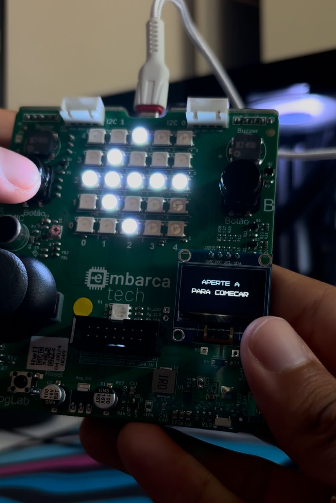

# Jogo de Reflexo com BitDogLab

|  |  |
|-----------------------------------|-----------------------------------|
|         Tela de início            |          Tela de placar           |

## Descrição

Este é um jogo de reflexo desenvolvido para a placa **BitDogLab**, que utiliza a **Raspberry Pi Pico W** como seu microcontrolador. O objetivo do jogo é testar o tempo de reação dos jogadores ao pressionar os botões assim que um LED acende. A pontuação é exibida em uma matriz de LEDs e o vencedor é indicado por uma melodia tocada por um buzzer. 

O jogo foi programado de forma simples, mas desafiadora, oferecendo uma maneira divertida de treinar os reflexos. A versão atual  foi desenvolvida para funcionar com a **BitDogLab** e seus componentes.

## Materiais Utilizados

- **Placa BitDogLab com Raspberry Pi Pico W**
  - **Botões**: Utilizados para interação do jogador com o jogo.
  - **Matriz de LEDs**: Exibe o placar do jogo.
  - **Buzzer**: Emite sons para feedback e sinalizar a vitória.
  - **Display Oled**: Emite alertas de início do jogo, vencedor e mostra o placar.
  - **Raspberry Pi Pico W**: Microcontrolador que gerencia a placa e executa o código programado.

- **Linguagem**: C, programada para interação com os componentes da BitDogLab.

## Funcionamento da Placa

A placa **BitDogLab**, que utiliza a **Raspberry Pi Pico W** como microcontrolador, foi usada para interagir com os LEDs, os botões, o buzzer e o display oled. O jogo funciona da seguinte forma:

1. Um led na cor branca acende aleatoriamente entre um tempo de 1s a 7s.
2. O jogador precisa pressionar o botão assim que perceber o led sendo aceso.
3. O tempo de resposta é medido e a pontuação é registrada.
4. O placar é exibido no display oled e na matriz de LEDs.
5. O buzzer emite um som de vitória para o jogador que alcançar mais pontos.

[Vídeo de Demonstração](https://youtube.com/shorts/FMKY9TK0UeQ?feature=share)

### Funcionalidades Futuras

Esta versão 1.0 do projeto oferece o básico do jogo de reflexo. No futuro, serão adicionadas funcionalidades como:
- Mais modos de jogo.
- Estatísticas de desempenho.

